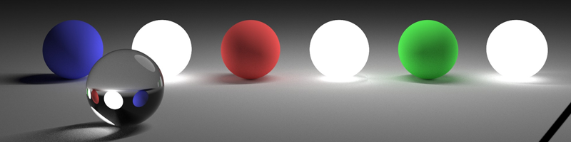
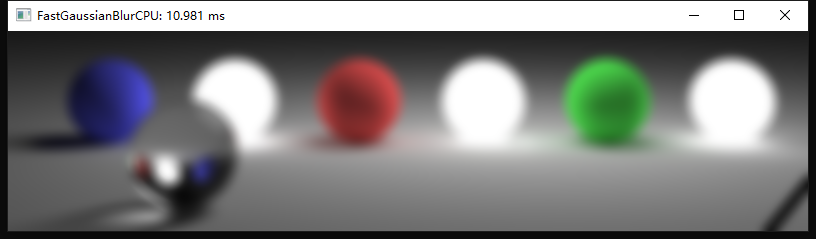
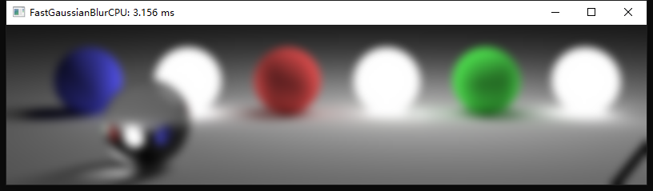
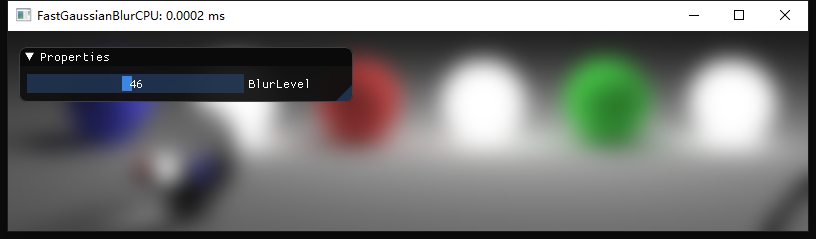
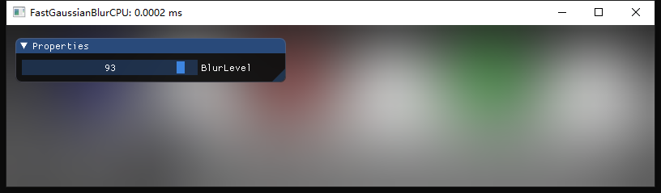

# Fast Gaussian Blur
实时高斯模糊， CPU算法4为Adobe Photoshop的实现方案
* 原图

   

## CPU方案
Demo中给出了4种算法的实现，窗口标题为算法所耗时间
* 算法1

   

* 算法2

    

* 算法3

   

* 算法4

   

## GPU方案
T.T gif录出来的效果太差了. 有前辈知道好用的gif录制工具还请告知。

这个gif是拿GifCam录的。Screen2Gif也试过了。。还没这个效果好。。

   

   

   

 
 

## 参考资料及其他资料
http://blog.ivank.net/fastest-gaussian-blur.html

https://www.peterkovesi.com/papers/FastGaussianSmoothing.pdf

https://blog.csdn.net/fightingforcv/article/details/51785681