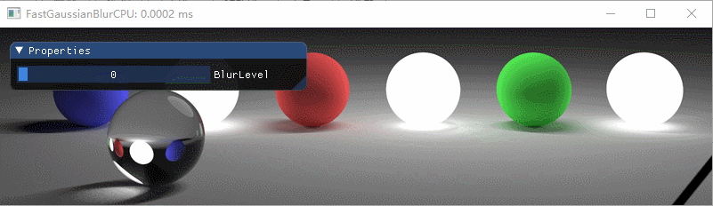

# Fast Gaussian Blur
实时高斯模糊， CPU算法4为Photopea的实现方案
* 原图

   

## CPU方案
Demo中给出了4种算法的实现，窗口标题为算法所耗时间
* 算法1

   

* 算法2

    

* 算法3

   

* 算法4

   

## GPU方案

   

   

   

 
 

## 参考资料及其他资料
http://blog.ivank.net/fastest-gaussian-blur.html

https://www.peterkovesi.com/papers/FastGaussianSmoothing.pdf

https://blog.csdn.net/fightingforcv/article/details/51785681
